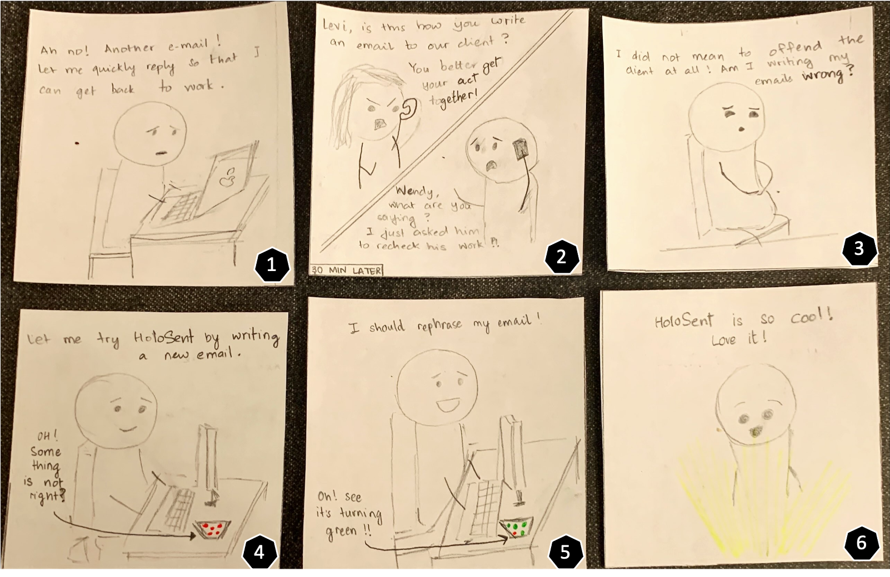
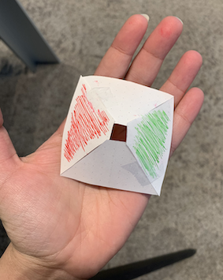

# Staging Interaction

In the original stage production of Peter Pan, Tinker Bell was represented by a darting light created by a small handheld mirror off-stage, reflecting a little circle of light from a powerful lamp. Tinkerbell communicates her presence through this light to the other characters. See more info [here](https://en.wikipedia.org/wiki/Tinker_Bell). 

There is no actor that plays Tinkerbell--her existence in the play comes from the interactions that the other characters have with her.

For lab this week, we draw on this and other inspirations from theatre to stage interactions with a device where the main mode of display/output for the interactive device you are designing is lighting. We plot the interaction with a storyboard, and use our computer and a smartphone to experiment with what the interactions will look and feel like.

## Prep

1. Set up [your Github "Lab Hub" repository](../../../) by [following these instructions](https://github.com/FAR-Lab/Developing-and-Designing-Interactive-Devices/blob/2021Spring/readings/Submitting%20Labs.md).
2. Set up the README.md for your Hub repository (for instance, so that it has your name and points to your own Lab 1) and [learn how](https://guides.github.com/features/mastering-markdown/) to post links to your submissions on your readme.md so we can find them easily.

### For lab, we need:

1. Paper
1. Markers & Pen
1. Smart Phone--Main required feature is that the phone should be able to connect to Zoom, which will be used to project the images.
1. Computer--The computer is used to broadcast the videos which will be projected using our device.
1. OHP Sheet, Scotch Tape, Scissors, Ruler--we costume our phone so that it looks like some other device.

### Deliverables for this lab are: 
1. Storyboard
1. Sketches/photos of costumed device
1. Any reflections you have on the process.
1. Video sketch of the prototyped interaction.

## Overview
For this assignment, you are going to 

A) [Plan](#part-a-plan) 

B) [Act out the interaction](#part-b-act-out-the-interaction) 

C) [Prototype the device](#part-c-prototype-the-device)

D) [Wizard the device](#part-d-wizard-the-device) 

E) [Costume the device](#part-e-costume-the-device)

F) [Record the interaction](#part-f-record)

## Part A. Plan

_Setting:_ Our player, Levi, has been working from home due to the pandemic that has taken the world by storm. While he has set up a perfect workspace to keep his productivity high, the number of emails/IMs he has to engage in frustrates him. As a result, he tends to rush through them often, and ends up misrepresenting his sentiments behind the messages.

_Players:_ Levi is the primary player in our setting, who is struggling how to effectively communicate with his colleagues and clients. His colleagues and clients are secondary players who will benefit if he is more cogent with his words.

_Activity:_ HoloSent (Hologram + Sentiment) comes with a browser extension which Levi installs on his computer. Now, all of Levi’s messages are promptly evaluated by this device, the colour projections of which identify the sentiment conveyed by his messages. When Levi notices a mismatch between his emotion and the colour on HoloSent, he knows he should rephrase his message.

_Goals:_ The “Work From Home” shift has caused every person to rely more heavily on emails/written messages as opposed to physical meetings as the primary mode of communication. As we navigate this new normal, it is imperative that we convey sentiments/emotions clearly through written messages in order to build/maintain lasting relationships. 

HoloSent can detect the sentiment conveyed by your messages in real-time, thereby guiding you to communicate more effectively. Through its different colours, it expresses the tone of your message (Red-Angry,Rude, Blue-Calm, Green-Happy/Interested, White-Professional). This is particularly useful when the tone does not match your intention, allowing you to fix the message and be more adept in your communication skills.

A storyboard of the interactions can be seen below.

Present your idea to the other people in your breakout room. You can just get feedback from one another or you can work together on the other parts of the lab.
**Summarize feedback you got here.**

## Part B. Act out the Interaction

Try physically acting out the interaction you planned. For now, you can just pretend the device is doing the things you’ve scripted for it. 

**Are there things that seemed better on paper than acted out?**

**Are there new ideas that occur to you or your collaborators that come up from the acting?**
Some new ideas that popped up when the team was acting out the interaction were:
* Use as reminders - Sync with reminders on your cell phone, and use some key images from the description to remind the user when its time for their activity (example - the picture of a dumbbells when its time to head to the gym)
* 

## Part C. Prototype the device

Our smartphone is used as a stand-in for the device you are prototyping. You will use the browser of your smart phone to act as a “light” and use a remote control interface to remotely change the light on that device. 

We will not be using "Tinkerbelle" for our prototype. Instead, we use Zoom, where the screen shared from the laptop is rendered on the phone and projected using our Pyramid Hologram.

A prototype of our pyramid can be seen below. We shade opposite sides red and green to denote the sentiment conveyed by the user.

## Part D. Wizard the device
Take a little time to set up the wizarding set-up that allows for someone to remotely control the device while someone acts with it. Hint: You can use Zoom to record videos, and you can pin someone’s video feed if that is the scene which you want to record. 

**Include your first attempts at recording the set-up video here.**

Now, change the goal within the same setting, and update the interaction with the paper prototype. 

**Show the follow-up work here.**

## Part E. Costume the device

We create a DIY 3D Pyramid Hologram using an OHP Sheet, clear tape and a pair of scissors. This [tutorial](https://www.instructables.com/DIY-Pyramid-Hologram/) is used for inspiration. 

Think about the setting of the device: is the environment a place where the device could overheat? Is water a danger? Does it need to have bright colors in an emergency setting?

**Include sketches of what your device might look like here.**

The pandemic is one of the primary reasons this idea was thought of. The hologram beside one's computer could work both as a decorative piece with a purpose.

## Part F. Record

**Take a video of your prototyped interaction.**

Samantha Lee (snl48) and Shivani Doshi (sgd73) collaborated with me to brainstorm, record and provide feedback on this lab/

# Staging Interaction, Part 2 

This describes the second week's work for this lab activity.

## Prep (to be done before Lab on Wednesday)

You will be assigned three partners from another group. Go to their github pages, view their videos, and provide them with reactions, suggestions & feedback: explain to them what you saw happening in their video. Guess the scene and the goals of the character. Ask them about anything that wasn’t clear. 

**Summarize feedback from your partners here.**

## Make it your own

Do last week’s assignment again, but this time: 
1) It doesn’t have to (just) use light, 
2) You can use any modality (e.g., vibration, sound) to prototype the behaviors, 
3) We will be grading with an emphasis on creativity. 

**Document everything here.**
